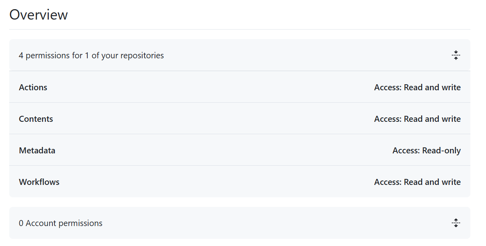
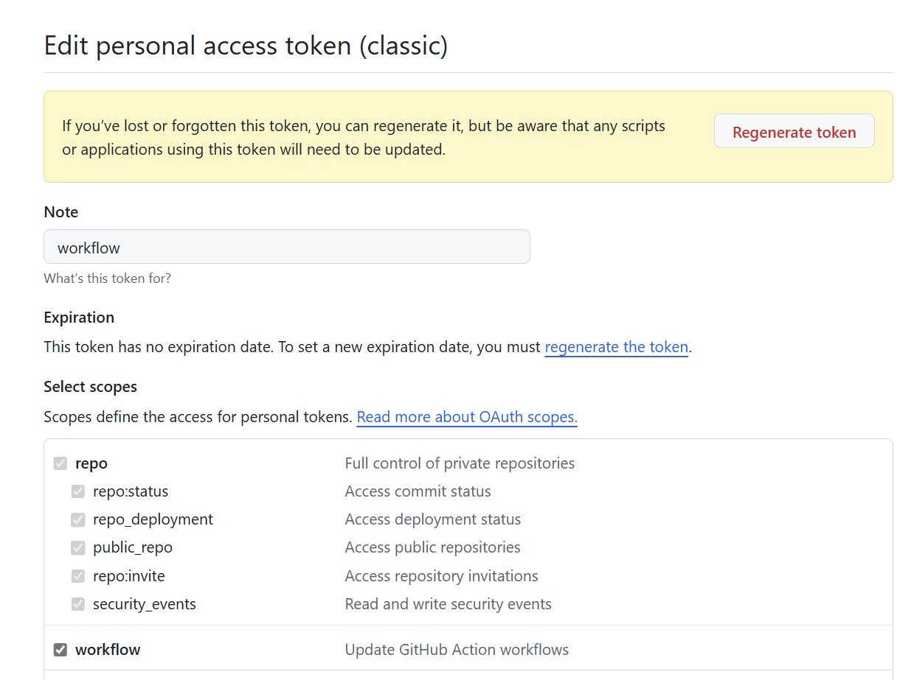

# GitHub Actions 工作流推送指南

## 目录
- [GitHub Actions 工作流推送指南](#github-actions-工作流推送指南)
  - [目录](#目录)
  - [简介](#简介)
  - [工作流文件](#工作流文件)
  - [配置步骤](#配置步骤)
  - [权限要求](#权限要求)
    - [Fine-grained Token 权限](#fine-grained-token-权限)
    - [Classic Token 权限](#classic-token-权限)
  - [故障排除](#故障排除)
    - [常见错误](#常见错误)
  - [注意事项](#注意事项)

## 简介

本指南介绍如何使用 GitHub Actions 推送工作流文件到仓库。通过配置正确的权限和令牌，您可以自动化工作流文件的更新过程。

## 工作流文件

工作流文件位于 `.github/workflows/Push workflow using action.yml`，主要功能包括：

1. 检查并删除已存在的 `hello.yml` 文件
2. 创建新的工作流文件，包含随机中文名字
3. 使用 GitHub Actions 推送更改

## 配置步骤

1. **创建个人访问令牌**
   - 访问 GitHub 设置 > Developer settings > Personal access tokens
   - 选择 "Fine-grained tokens" 或 "Tokens (classic)"
   - 配置以下权限：
     - Contents: Read and write
     - Workflows: Read and write
     - Actions: Read and write
     - Metadata: Read

2. **添加仓库密钥**
   - 进入仓库设置 > Secrets and variables > Actions
   - 创建新密钥，命名为 `WORKFLOW_TOKEN`
   - 粘贴您的个人访问令牌

3. **运行工作流**
   - 手动触发工作流
   - 检查运行日志，确保所有步骤成功完成

## 权限要求

### Fine-grained Token 权限
- Repository access: Only select repositories
- 权限设置：
  - Contents: Read and write
  - Workflows: Read and write
  - Actions: Read and write
  - Metadata: Read



### Classic Token 权限
- 选择以下权限：
  - repo
  - workflow



## 故障排除

### 常见错误
1. **403 错误**
   - 检查令牌权限是否完整
   - 验证令牌是否过期
   - 确认仓库访问权限

2. **认证失败**
   - 使用以下命令测试令牌：
     ```bash
     curl -H "Authorization: token $TOKEN" https://api.github.com/user
     ```

3. **工作流推送失败**
   - 检查工作流文件语法
   - 验证分支权限
   - 确认令牌配置正确

## 注意事项

1. 令牌安全
   - 不要将令牌提交到代码仓库
   - 定期轮换令牌
   - 使用最小必要权限

2. 工作流限制
   - GitHub Actions 有使用限制
   - 注意并发工作流数量
   - 监控工作流执行时间

3. 最佳实践
   - 使用环境变量存储敏感信息
   - 添加适当的错误处理
   - 定期审查工作流配置
